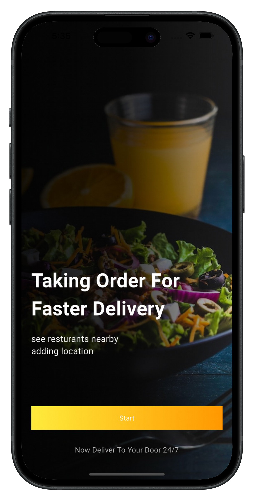
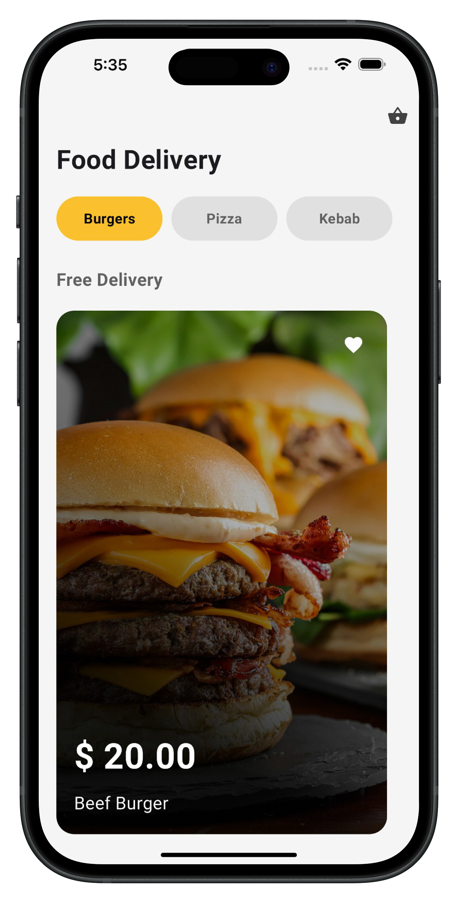
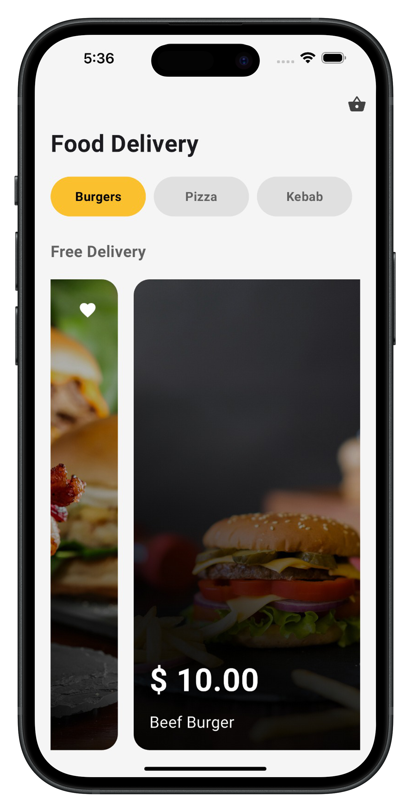
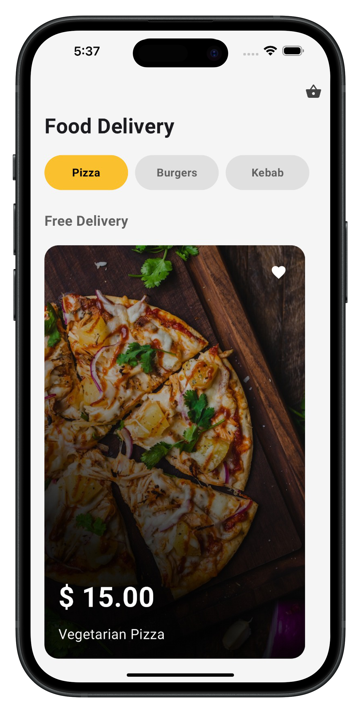
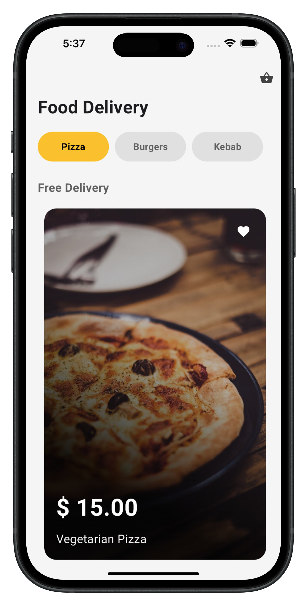
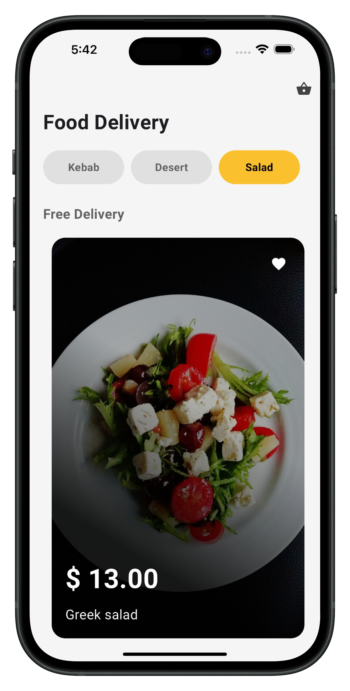

# food_delivery_app_ui

This Food Delivery App features a clean and intuitive user interface designed for seamless navigation. Users can explore a variety of food categories, including burgers, pizzas, and kebabs, with just a tap. The app highlights free delivery options and provides visually appealing product cards with pricing and descriptions to enhance the browsing experience. Whether you're craving a juicy burger or a slice of pizza, this app ensures a delightful and hassle-free food ordering process

## Screenshots

  

  
    
      
        
          

- [Lab: Write your first Flutter app](https://docs.flutter.dev/get-started/codelab)
- [Cookbook: Useful Flutter samples](https://docs.flutter.dev/cookbook)

For help getting started with Flutter development, view the
[online documentation](https://docs.flutter.dev/), which offers tutorials,
samples, guidance on mobile development, and a full API reference.
# food-delivery-ui_app
